# Peppermint Helpdesk - Complete Guide

> **Open-source ticket management and helpdesk solution**  
> Alternative to Zendesk & Jira | Built with Node.js + TypeScript

**Version**: 0.5.4 (Latest)  
**Website**: [peppermint.sh](https://peppermint.sh)  
**GitHub**: [Peppermint-Lab/peppermint](https://github.com/Peppermint-Lab/peppermint)  
**Docs**: [docs.peppermint.sh](https://docs.peppermint.sh)  
**Discord**: [Community](https://discord.gg/cyj86Ncygn)

---

## Overview

Peppermint is an **open-source issue management and helpdesk solution** designed to be a cost-effective alternative to Zendesk and Jira. It's built with Node.js and TypeScript, making it lightweight, fast, and suitable for self-hosting.

### Key Benefits
- 🆓 **Free & Open Source** - No licensing fees
- 🚀 **Lightweight** - Runs on low-end VPS or Raspberry Pi
- 🔒 **Privacy-Focused** - All data stays on your server
- 🌐 **Offline Capable** - Works without internet connection
- 📱 **Responsive** - Mobile to 4K screen support

---

## ✨ Features

### Core Ticketing
| Feature | Description |
|---------|-------------|
| Ticket Creation | Markdown editor with file uploads |
| Client History | Full log of client interactions |
| Notebook | Markdown-based notebook with todo lists |
| Multi-deployment | Docker, PM2, or local NodeJS |

### Email Integration ✅
| Capability | Details |
|------------|---------|
| **SMTP/IMAP** | Configure mailboxes to fetch emails |
| **Email → Ticket** | Automatically convert emails to tickets |
| **Email Notifications** | Send ticket updates via email |
| **Reply by Email** | Respond to tickets directly from email |

### Webhooks ✅
| Capability | Details |
|------------|---------|
| **Outbound Webhooks** | Notify third-party services on ticket events |
| **Triggers** | Fire webhooks on ticket creation/update |
| **Planned** | Slack, Telegram, Discord integrations |

### Authentication
| Method | Support |
|--------|---------|
| **OIDC** | Connect to existing identity providers |
| **Local** | Built-in user management |

---

## 📧 Email Integration (Gmail & Outlook)

Peppermint supports email integration via **SMTP/IMAP** protocols.

### Gmail Setup

#### SMTP (Outgoing)
```
Host: smtp.gmail.com
Port: 587 (TLS) or 465 (SSL)
Username: your-email@gmail.com
Password: App Password (required with 2FA)
```

#### IMAP (Incoming)
```
Host: imap.gmail.com
Port: 993 (SSL)
Username: your-email@gmail.com
Password: App Password
```

> **⚠️ Important**: Gmail requires an **App Password** if 2FA is enabled. Generate one at [Google Account Security](https://myaccount.google.com/apppasswords).

### Outlook/Office 365 Setup

#### SMTP (Outgoing)
```
Host: smtp.office365.com
Port: 587 (TLS)
Username: your-email@outlook.com
Password: Your password (or App Password for 2FA)
```

#### IMAP (Incoming)
```
Host: outlook.office365.com
Port: 993 (SSL)
Username: your-email@outlook.com
Password: Your password
```

### Configuration Steps in Peppermint

1. Navigate to **Admin Settings**
2. Go to **Email Queues**
3. Configure **SMTP Settings** for outgoing mail
4. Configure **IMAP Settings** for incoming mail
5. Set **Reply Email Address** (different from inbox to avoid loops)

> **⚠️ Warning**: Using the same email for both sending and receiving can create email loops!

### ⚠️ Email Loop Scenario Explained

Using the same email address for both receiving tickets and sending replies creates an **infinite loop**:

```mermaid
sequenceDiagram
    participant Inbox as support@company.com (Inbox)
    participant Peppermint as Peppermint
    participant SMTP as Outgoing SMTP
    
    Note over Inbox,SMTP: ❌ BAD: Same email for both
    
    Inbox->>Peppermint: Customer email arrives
    Peppermint->>Peppermint: Creates Ticket #1
    Peppermint->>SMTP: Sends auto-reply "Ticket received!"
    SMTP->>Inbox: Reply lands in SAME inbox
    Inbox->>Peppermint: Sees new email (its own reply)
    Peppermint->>Peppermint: Creates Ticket #2 (from auto-reply!)
    Peppermint->>SMTP: Sends auto-reply for Ticket #2
    SMTP->>Inbox: Reply lands again...
    Note over Inbox,SMTP: ♾️ INFINITE LOOP!
```



**What Happens:**
1. **Customer** emails `support@company.com`
2. **Peppermint** polls inbox, creates **Ticket #1**
3. **Peppermint** sends auto-reply: *"Thanks, we received your ticket!"*
4. That reply is **sent FROM** `support@company.com`
5. The reply **lands IN** `support@company.com` inbox (same email!)
6. **Peppermint** polls again, sees "new" email
7. **Creates Ticket #2** from its own auto-reply
8. **Sends another auto-reply**... 
9. 🔄 **Repeat infinitely** → Thousands of tickets in minutes!

**✅ Correct Setup:**

| Purpose | Email | Example |
|---------|-------|---------|
| **Receiving** (IMAP inbox) | Ticket intake | `support@company.com` |
| **Sending** (SMTP from) | Reply address | `noreply@company.com` or `helpdesk@company.com` |

**Impact on AI Workflows:**
If you're triggering AI workflows via webhooks when tickets are created, an email loop would:
- 🚨 Trigger your AI workflow thousands of times
- 💸 Consume API credits rapidly
- 📧 Spam customers with endless auto-replies
- 🔥 Potentially crash your system

> [!CAUTION]
> **Always use separate email addresses for inbox vs. outgoing replies!**

### ✅ Solution: Smart Webhook Filtering + Direct API Replies

You can avoid email loops by combining **webhook filtering** with **direct API replies**:

```mermaid
flowchart TD
    A[Email Arrives] --> B{Check Sender}
    B -->|External Customer| C[Trigger Webhook ✅]
    B -->|Your Domain/System| D[Ignore ❌]
    C --> E[AI Processes]
    E --> F[AI Sends Reply via Gmail/Outlook API]
    F --> G[Reply sent directly - NOT through monitored inbox]
```



#### Strategy 1: Filter Webhooks in Your Backend

```python
from fastapi import FastAPI, Request

@app.post("/webhook/peppermint")
async def handle_peppermint_webhook(request: Request):
    payload = await request.json()
    
    # Get sender email
    sender = payload.get("ticket", {}).get("customer", {}).get("email", "")
    
    # ❌ Ignore if sender is your own system/domain
    ignore_list = [
        "noreply@yourcompany.com",
        "helpdesk@yourcompany.com",
        "@yourcompany.com",  # Ignore all internal emails
    ]
    
    if any(pattern in sender for pattern in ignore_list):
        return {"status": "ignored", "reason": "internal email"}
    
    # ✅ Only process external customer emails
    if payload.get("event") == "ticket.created":
        await trigger_ai_workflow(payload)
        
    return {"status": "processed"}
```

#### Strategy 2: Additional Safety Checks

| Check | Purpose | Example |
|-------|---------|---------|
| **Sender domain** | Ignore internal emails | Skip `@yourcompany.com` |
| **Subject line** | Ignore auto-replies | Skip if contains "Auto-Reply" |
| **Email headers** | Check for auto-reply header | Skip if `X-Auto-Reply: yes` |
| **Rate limiting** | Prevent flood | Max 1 ticket per email/minute |
| **De-duplication** | Skip processed emails | Store email IDs in Redis |

#### Strategy 3: Disable Peppermint Auto-Reply + Use Direct API

The best approach: Disable Peppermint's auto-reply and send replies directly via Gmail/Outlook API:


> [!TIP]
> **Send AI replies via the Gmail/Outlook API directly, NOT through the monitored inbox.** This completely eliminates the loop risk.

---

## 🔗 Webhooks

Peppermint supports outbound webhooks for integration with third-party services.

### How Webhooks Work
```
Ticket Event (Create/Update) → Webhook Triggered → POST to External URL
```

### Webhook Events
- New ticket created
- Ticket status changed
- Ticket assigned
- Customer reply received

### Example: Trigger AI Workflow


### Webhook Payload (Example)
```json
{
  "event": "ticket.created",
  "ticket": {
    "id": "123",
    "title": "Help needed",
    "content": "Email body...",
    "customer": {
      "email": "customer@example.com",
      "name": "John Doe"
    }
  }
}
```

---

## 🐳 Docker Deployment

### Quick Start (One-liner)
```bash
curl -sSL -o deployer.sh https://deploy.spearmint.sh && chmod +x deployer.sh && ./deployer.sh
```

### Docker Compose

```yaml
version: "3.1"

services:
  peppermint_postgres:
    container_name: peppermint_postgres
    image: postgres:latest
    restart: always
    ports:
      - 5432:5432
    volumes:
      - pgdata:/var/lib/postgresql/data
    environment:
      POSTGRES_USER: peppermint
      POSTGRES_PASSWORD: your_secure_password
      POSTGRES_DB: peppermint

  peppermint:
    container_name: peppermint
    image: pepperlabs/peppermint:latest
    ports:
      - 3000:3000
      - 5003:5003
    restart: always
    depends_on:
      - peppermint_postgres
    environment:
      DB_USERNAME: "peppermint"
      DB_PASSWORD: "your_secure_password"
      DB_HOST: "peppermint_postgres"
      SECRET: "your_secure_secret_key"

volumes:
  pgdata:
```

### Environment Variables

| Variable | Description | Required |
|----------|-------------|----------|
| `DB_USERNAME` | PostgreSQL username | ✅ |
| `DB_PASSWORD` | PostgreSQL password | ✅ |
| `DB_HOST` | PostgreSQL host | ✅ |
| `SECRET` | Encryption key (generate strong key!) | ✅ |
| `POSTGRES_USER` | DB admin username | ✅ |
| `POSTGRES_PASSWORD` | DB admin password | ✅ |
| `POSTGRES_DB` | Database name | ✅ |

### Default Login
```
Email: admin@admin.com
Password: 1234
```

> **⚠️ Change immediately after first login!**

---

## 🚀 Railway Deployment

### Steps

1. Create new project on [Railway](https://railway.app)
2. Add **PostgreSQL** service
3. Add **Peppermint** service from Docker Hub:
   - Image: `pepperlabs/peppermint:latest`
4. Configure environment variables:

```env
DB_USERNAME=postgres
DB_PASSWORD=${{Postgres.POSTGRES_PASSWORD}}
DB_HOST=${{Postgres.RAILWAY_PRIVATE_DOMAIN}}
SECRET=generate_a_strong_secret_here
```

5. Set public domain and deploy

### Ports
- **3000**: Web UI
- **5003**: API

---

## 📊 Comparison with Alternatives

| Feature | Peppermint | Trudesk | Chatwoot | Frappe Helpdesk |
|---------|------------|---------|----------|-----------------|
| **Language** | TypeScript/Node | Node.js | Ruby/Vue | Python |
| **Email → Ticket** | ✅ SMTP/IMAP | ✅ IMAP | ✅ | ✅ |
| **Webhooks** | ✅ | ❌ Limited | ✅ | ✅ |
| **Triggers** | ✅ | ❌ | ✅ | ✅ |
| **OIDC/SSO** | ✅ | ❌ | ✅ | ✅ |
| **Lightweight** | ✅ | ✅ | ⚠️ Heavy | ⚠️ Heavy |
| **Docker** | ✅ | ✅ | ✅ | ✅ |
| **Stars** | 6k+ | 1.3k | 21k+ | 2.8k |

---

## ⚠️ Known Limitations

1. **OAuth Not Supported** - Gmail/Outlook use SMTP/IMAP (App Passwords required)
2. **No Push Notifications** - Email fetched via polling, not real-time push
3. **Documentation** - Some navigation issues reported
4. **Email Threading** - Basic compared to enterprise solutions

---

## 🔄 Integration with Your System

### Triggering Flowise/AI Workflows


### Webhook Endpoint (FastAPI Example)

```python
from fastapi import FastAPI, Request

app = FastAPI()

@app.post("/webhook/peppermint")
async def handle_peppermint_webhook(request: Request):
    payload = await request.json()
    
    if payload.get("event") == "ticket.created":
        ticket = payload.get("ticket")
        # Trigger AI workflow
        # ...
        
    return {"status": "received"}
```

---

## 📚 Resources

- **Official Docs**: [docs.peppermint.sh](https://docs.peppermint.sh)
- **GitHub**: [Peppermint-Lab/peppermint](https://github.com/Peppermint-Lab/peppermint)
- **Docker Hub**: [pepperlabs/peppermint](https://hub.docker.com/r/pepperlabs/peppermint)
- **Community**: [Discord](https://discord.gg/cyj86Ncygn)
- **Linode Marketplace**: [One-click deploy](https://www.linode.com/marketplace/apps/peppermint-lab/peppermint/)

---

## ✅ Summary

| Requirement | Peppermint Support |
|-------------|-------------------|
| JavaScript/TypeScript | ✅ Node.js + TypeScript |
| Gmail Integration | ✅ via SMTP/IMAP |
| Outlook Integration | ✅ via SMTP/IMAP |
| Webhooks | ✅ Full support |
| Triggers | ✅ Ticket lifecycle events |
| Self-hosted | ✅ Docker, PM2, local |
| Open Source | ✅ MIT License |
| Lightweight | ✅ Low resource usage |

**Peppermint is a solid choice for a TypeScript-based, self-hosted helpdesk with email integration and webhook support for triggering AI workflows.**
